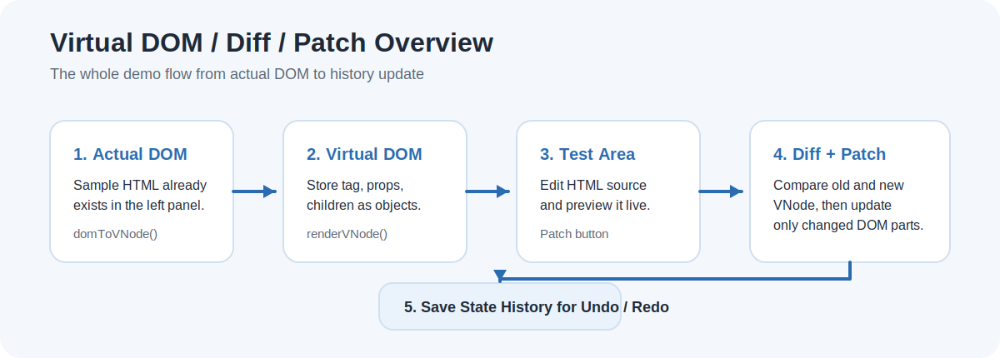
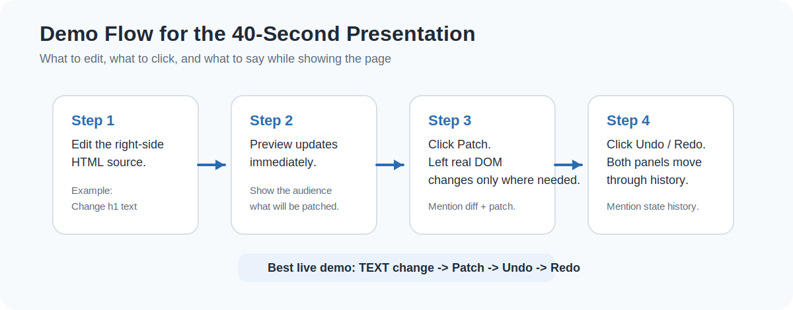

# React_virtualDOM & diff algorithm

## Index
1. virtual DOM이란
2. virtual DOM이 왜 필요한가
3. 우리팀이 만든 virtual DOM의 구조
4. Diff 알고리즘은 언제 어디에 어떻게 쓰이는가
5. React에서 실제 DOM을 변경할 때, Virtual DOM과 DIFF 알고리즘의 동작 방식
6. Edge case
7. 시연


## virtual DOM 이란

- 실제 DOM의 가벼운 복사본. 즉, DOM을 단순한 JavaScript 객체 구조로 표현한 것.
- 리액트가 UI의 변화를 효율적으로 처리하기 위해 사용된다


## virtual DOM이 왜 필요한가

- virtual DOM이 없었을 때 :
  DOM이 Update 된다 = HTML 요소에 변화가 발생
  브라우저는 DOM이 변화하면 화면을 다시 그린다

## 그런데
  변화 하나하나마다 화면을 계속 새로 그리는 **오버헤드**가 일어난다.
  


## Virtual DOM이 필요한 이유

- Virtual DOM은 실제 DOM을 단순한 JavaScript 객체 구조로 표현한 것이다.
- 객체끼리 비교하는 것이 실제 DOM을 계속 직접 수정하는 것보다 다루기 쉽다.
- 먼저 메모리 안에서 변경점을 찾고, 마지막에 필요한 부분만 실제 DOM에 적용할 수 있다.

### 현재 프로젝트의 Virtual DOM 구조

```js
{
  type: "element",
  tag: "div",
  props: { class: "demo-card" },
  children: [
    { type: "text", text: "hello" }
  ]
}
```

## 핵심 함수 설명

### `domToVNode(node)`

- 실제 DOM 노드를 읽어서 Virtual DOM 객체로 바꾼다.
- 텍스트 노드와 엘리먼트 노드를 구분해서 저장한다.
- 과제 데모에서 필요 없는 공백 텍스트는 제외한다.

### `renderVNode(vnode)`

- Virtual DOM 객체를 다시 실제 DOM 노드로 만들어 준다.
- 초기 렌더링과 Undo / Redo 복원에 사용한다.

### `diff(oldVNode, newVNode)`

- 이전 Virtual DOM과 새 Virtual DOM을 비교한다.
- 아래 5가지 변경을 판별한다.
- 노드 추가
- 노드 삭제
- 태그 변경
- 텍스트 변경
- 속성 변경
- child 비교는 과제 범위에 맞게 index 기반으로 단순하게 처리한다.

### `applyPatch(realRoot, patches)`

- diff 결과를 바탕으로 왼쪽 실제 DOM에 변경 부분만 반영한다.
- index 기반 child 비교를 사용하므로 같은 부모의 뒤쪽 자식부터 적용한다.

### `createHistoryManager(initialVNode)`

- 상태 배열과 현재 인덱스를 관리한다.
- `push`, `undo`, `redo`를 단순하게 제공한다.

## Virtual DOM / Diff / Patch 동작 흐름

1. 페이지가 열리면 왼쪽 실제 DOM의 샘플 HTML을 `domToVNode()`로 읽는다.
2. 읽은 Virtual DOM을 이용해서 오른쪽 HTML 입력창과 테스트 미리보기를 같은 구조로 만든다.
3. 초기 Virtual DOM을 history의 첫 상태로 저장한다.
4. 사용자가 오른쪽 HTML 입력창을 수정한다.
5. 입력값을 파싱해서 오른쪽 테스트 미리보기 DOM을 만든다.
6. `Patch` 버튼을 누르면 오른쪽 현재 미리보기 DOM을 다시 `domToVNode()`로 변환한다.
7. 이전 상태와 새 상태를 `diff()`로 비교한다.
8. 나온 patch 목록을 `applyPatch()`로 왼쪽 실제 DOM에만 반영한다.
9. 새 상태를 history에 저장한다.
10. `Undo`, `Redo`를 누르면 저장된 Virtual DOM으로 왼쪽 실제 DOM, 오른쪽 HTML 입력창, 오른쪽 미리보기를 함께 다시 렌더링한다.



## Diff 알고리즘 설명

### 동작 방식

1. 이전 Virtual DOM과 새 Virtual DOM의 루트부터 비교한다.
2. 타입이 다르면 교체한다.
3. 둘 다 텍스트 노드면 텍스트 값만 비교한다.
4. 둘 다 엘리먼트 노드면 태그와 속성을 비교한다.
5. 자식 노드는 같은 index끼리 순서대로 비교한다.
6. 찾은 변경 사항을 patch 목록으로 저장한다.

### 최소 변경을 찾기 위한 5가지 핵심 케이스

1. 노드 추가: 새 Virtual DOM에만 있는 노드를 추가한다.
2. 노드 삭제: 이전 Virtual DOM에만 있는 노드를 삭제한다.
3. 태그 변경: 같은 위치인데 태그가 다르면 해당 노드를 교체한다.
4. 텍스트 변경: 텍스트 노드 내용이 바뀌면 텍스트만 교체한다.
5. 속성 변경: `class`, `data-id` 같은 속성 차이만 따로 반영한다.


### 실제 DOM 반영 방법

- `ADD`는 새 노드를 만들어 해당 위치에 삽입한다.
- `REMOVE`는 기존 노드를 제거한다.
- `REPLACE`는 노드를 통째로 바꾼다.
- `TEXT`는 텍스트 내용만 바꾼다.
- `PROPS`는 바뀐 속성만 추가, 수정, 삭제한다.

## React와의 연결점

- React도 바로 실제 DOM을 조작하지 않고 먼저 Virtual DOM 개념으로 상태를 비교한다.
- 그리고 이전 상태와 새 상태의 차이를 계산한 뒤 필요한 부분만 실제 DOM에 반영한다.
- 이 프로젝트는 React 전체를 구현한 것은 아니고, 그 핵심 아이디어인 `Virtual DOM -> Diff -> Patch` 흐름만 학습용으로 단순화한 버전이다.

## 검증과 테스트

- 현재 저장소에는 자동 테스트 파일은 없고, 데모 페이지에서 직접 검증하는 방식으로 확인했다.
- 자동 테스트 파일이 추가되면 diff 결과와 history 동작을 반복 실행으로 빠르게 검증할 수 있고, 발표 때도 “어떤 케이스를 보장했는지”를 더 명확하게 보여줄 수 있다.
- 이번 구현에서는 시연 중심 과제에 맞춰 먼저 동작하는 데모와 수동 테스트 시나리오를 우선했다.

## 직접 테스트한 시나리오 5개

1. 오른쪽 HTML 입력창에서 제목 텍스트를 수정했을 때 아래 미리보기가 바로 바뀌는지 확인
2. 설명 문장을 수정하고 `Patch`를 눌렀을 때 왼쪽 제목이나 문단 중 바뀐 부분만 반영되는지 확인
3. `li` 하나를 지우고 `Patch`를 눌렀을 때 왼쪽 목록에서도 해당 노드가 제거되는지 확인
4. `li`를 하나 더 추가하고 `Patch`를 눌렀을 때 왼쪽 목록에 새 노드가 추가되는지 확인
5. 잘못된 HTML 구조를 넣었을 때 오른쪽 미리보기에 오류 메시지가 나오고 `Patch` 버튼이 비활성화되는지 확인



## 한계점

1. child 비교는 index 기반이므로 노드 재정렬이 많으면 효율적인 diff가 아니다.
2. 공백 텍스트 노드는 단순화를 위해 무시하므로 실제 브라우저 DOM과 완전히 동일한 텍스트 구조를 모두 보존하지는 않는다.
3. 테스트 영역은 HTML 입력창과 미리보기 중심의 구조이기 때문에 복잡한 편집기 기능까지 제공하지는 않는다.

## 발표 4분 요약

- 이 프로젝트는 React의 핵심 개념인 Virtual DOM, Diff, Patch를 가장 단순한 수준으로 직접 구현한 과제입니다.
- 먼저 왼쪽 실제 DOM을 Virtual DOM 객체로 바꾸고, 그 객체를 이용해 오른쪽 HTML 입력창과 미리보기를 초기화합니다.
- 사용자가 오른쪽 HTML을 수정하면 미리보기가 바뀌고, `Patch`를 누르면 현재 DOM을 다시 Virtual DOM으로 변환한 뒤 이전 상태와 비교합니다.
- 비교 결과는 노드 추가, 삭제, 태그 변경, 텍스트 변경, 속성 변경 형태의 patch 목록으로 만들어집니다.
- 이 patch 목록을 이용해 왼쪽 실제 DOM에는 바뀐 부분만 반영합니다.
- 그리고 새 Virtual DOM 상태를 history에 저장해서 `Undo`, `Redo`로 이전 상태와 다음 상태를 복원할 수 있습니다.
- 핵심 포인트는 전체를 다시 그리지 않고 변경된 부분만 반영하는 흐름을 직접 확인할 수 있다는 점입니다.
- 실제 DOM이 느린 이유, Virtual DOM이 필요한 이유, Diff의 5가지 핵심 케이스를 발표에서 함께 설명할 수 있도록 README에 정리했습니다.
