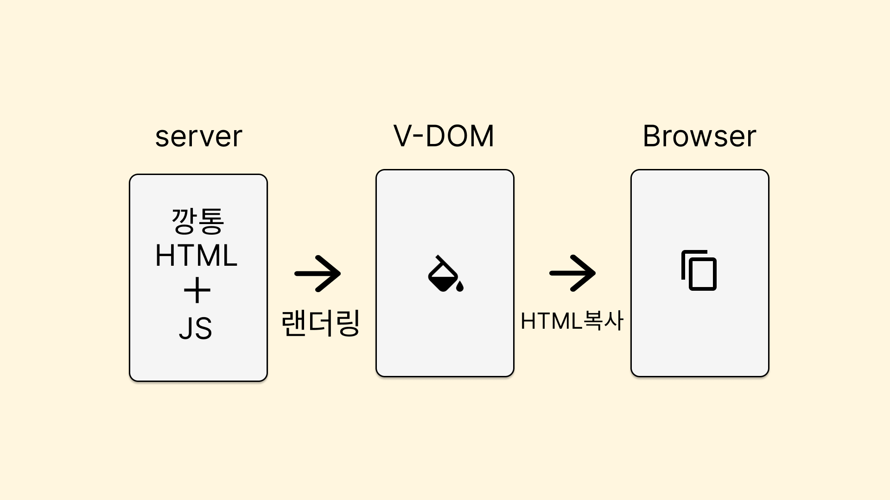
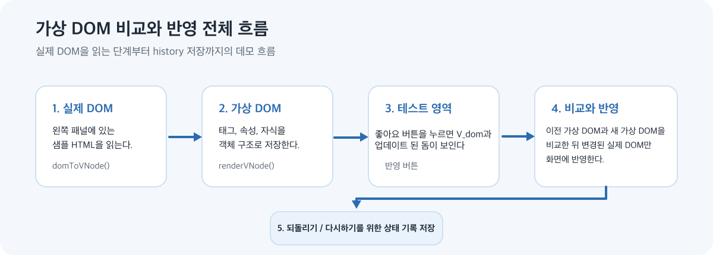
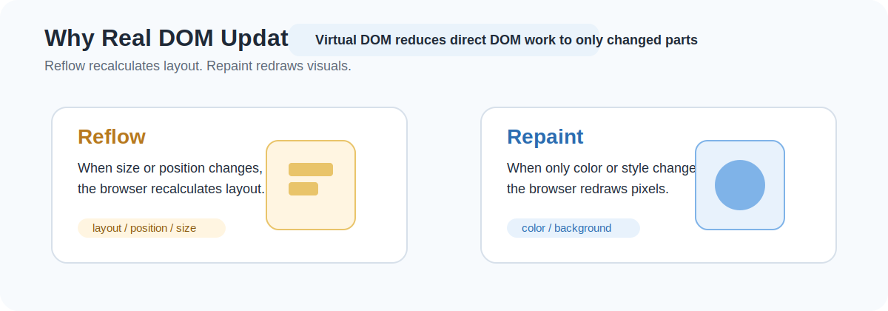
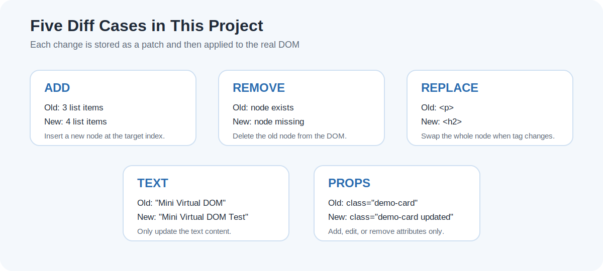

# week4_react_virtual DOM & DIFF algorithm

  
## 프로젝트 한 줄 요약

- Facebook에서 탄생한 react의 주요기능 중 virtual DOM 과 그 안에서 작동하는 DIFF Algorithm 이 데모 소셜 네트워크 브라우저에서 어떻게 동작하는지 확인합니다
   

## 왜 virtual DOM은 세상에 나왔는가

- Facebook의 복잡한 UI, 상태 동기화를 더 예측 가능하게 다루기 위해 즉, 복잡성을 낮추기 위해 React가 나왔고 virtual DOM은 이를 실용적인 성능으로 가능하게 만든 구현 전략

   

## 일반적인 React 환경에서 virtual DOM FLOW  &nbsp; (CSR SPA의 경우)

   
## 데모에서의 virtual DOM 생성 FLOW

   

## 실제 DOM 변화를 감지하기 위한 브라우저 API

이번 구현은 `MutationObserver`를 직접 사용하지 않고, 사용자 이벤트를 기준으로 상태 변화가 일어났을 때 Virtual DOM을 다시 만들고 diff를 수행하는 구조입니다.

하지만 브라우저에서 실제 DOM 변화 자체를 감시해야 한다면 `MutationObserver`가 대표적인 API입니다.

- 속성 변화 감지
- 자식 노드 추가/삭제 감지
- 텍스트 변경 감지

즉, 현재 프로젝트는 `event-driven diff`, 확장 아이디어로는 `MutationObserver 기반 실제 DOM 추적`까지 연결할 수 있습니다.

   

## React가 virtual DOM을 쓰는 이유  &nbsp; (feat.실제 DOM이 느린 이유)

실제 DOM은 단순한 JavaScript 객체가 아니라 브라우저 렌더링 엔진과 직접 연결된 구조입니다.  
DOM을 자주 건드리면 레이아웃 계산과 페인팅 비용이 따라옵니다.

### Reflow

- 요소 크기, 위치, 배치가 바뀔 때 레이아웃을 다시 계산합니다.
- 예: 노드 추가/삭제, width/height 변경, 텍스트 길이 변화

### Repaint

- 위치는 그대로지만 색상, 그림자, 배경 같은 시각적 표현이 바뀔 때 다시 그립니다.

즉, 실제 DOM을 계속 직접 수정하면 브라우저가 `layout -> paint -> composite` 단계를 반복 수행해야 하므로 비용이 커질 수 있습니다.  
Virtual DOM은 변경점을 메모리에서 먼저 계산하고, 마지막에 필요한 DOM만 건드리게 해주는 중간 계층 역할을 합니다.

   

## Diff 알고리즘

### 동작 방식

## 현재 구현의 한계

- 일반 케이스는 여전히 path/index 기반 비교입니다.
- `REORDER`는 key가 모두 고유하고 key 집합이 같은 경우에만 동작합니다.
- 현재 소셜 피드 데모의 VDOM은 형제 자식에 key를 넣지 않기 때문에 `REORDER`가 주 시연 흐름에 나타나지 않습니다.
- 컴포넌트 단위 memoization이 없습니다.
- 모든 비교가 순수 트리 순회 기반입니다.

   
## 우리가 만든 Virtual DOM과 React Virtual DOM의 기술적 특징 비교

| 항목 | 현재 프로젝트 | React |
| --- | --- | --- |
| 구현 목적 | 학습/시연용 최소 구현 | 대규모 UI 애플리케이션용 런타임 |
| 노드 구조 | `type`, `tag`, `props`, `children`, `text` 중심 구조 | React element + 내부 Fiber 구조 |
| diff 기준 | 기본은 index/path 비교, 일부 keyed `REORDER` 지원 | key + 타입 + Fiber reconciliation |
| 업데이트 트리거 | 명시적인 이벤트 처리 | state/props/context 변경 |
| 스케줄링 | 없음 | 우선순위 기반 스케줄링 |
| 렌더링 중단/재개 | 없음 | 가능(Concurrent features) |
| patch 단위 | DOM 노드/속성 수준 | commit phase에서 effect 단위 처리 |
| 이벤트 처리 | DOM event delegation 직접 구현 | Synthetic event 시스템 |
| 히스토리 | 수동 snapshot 관리 | React 자체 기능 아님, 앱 상태 관리와 조합 |
| 최적화 수준 | 단순 | 매우 높음 |

   

## 요구사항 구현
- `실제 영역` → 왼쪽 `User Page`
- `테스트 영역` → 오른쪽 `Focused Virtual DOM Compare`
- `Patch 버튼` → 왼쪽 카드의 `Like` 클릭이 patch 트리거 역할
- `뒤로가기 / 앞으로가기` → 상단 `Undo / Redo`

